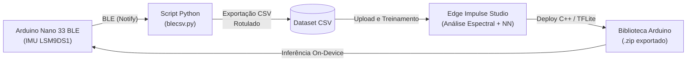

# TinyML: Classificação de Comportamento Bovino (Cow Behavior Classification)

Projeto de **TinyML (Machine Learning Embarcado)** voltado ao monitoramento e à classificação automática de atividades comportamentais em bovinos utilizando dados inerciais de sensores IMU (Acelerômetro e Giroscópio) processados diretamente em microcontrolador.

> **Status:** Concluído ✅  
> **Resultado:** Taxa de acerto global de **~80%** na classificação dos comportamentos.

---

## 📌 Visão Geral do Projeto

O objetivo deste projeto foi identificar padrões comportamentais de gado (como **parada**, **andando** e **comendo**) a partir de um dispositivo vestível (coleira/brinco inteligente). A solução foi desenvolvida de ponta a ponta: desde a coleta dos dados inerciais via Bluetooth (BLE) até a extração de *features*, treinamento da rede neural na plataforma **Edge Impulse** e a exportação do modelo compilado para execução na borda (*edge computing*).

### 👥 Informações do Projeto e Autoria
* **Desenvolvedores:** Samuel Loureiro e Flávio Rosim.
* **Plataforma de Treinamento:** [Edge Impulse](https://edgeimpulse.com/).
* **Conta do Projeto Edge Impulse:** Criado e hospedado na conta de Flávio Rosim (`flaviorosim`), sob o projeto **`cowBehaviorClassification`** (ID: `716438`). Os artefatos finais gerados foram exportados e versionados neste repositório.

### Arquitetura do Pipeline



---

## 📂 Estrutura do Repositório

| Arquivo | Descrição |
| :--- | :--- |
| [`IMUvaca.ino`](IMUvaca.ino) | Firmware em C++ para Arduino (Nano 33 BLE) que inicializa o sensor LSM9DS1 e envia leituras de aceleração e rotação ($a_x, a_y, a_z, g_x, g_y, g_z$) via Bluetooth Low Energy (BLE). |
| [`blecsv.py`](blecsv.py) | Script Python assíncrono (`bleak`) para PC que descobre o dispositivo `"IMU-Vaca"`, agrupa os dados em janelas temporais de 10 segundos, coleta os rótulos do usuário e salva em arquivos CSV. |
| [`ei-cowbehaviorclassification-arduino-1.0.2.zip`](ei-cowbehaviorclassification-arduino-1.0.2.zip) | Pacote C++ da biblioteca gerada pelo Edge Impulse (v1.0.2) contendo o bloco de DSP, o modelo TensorFlow Lite quantizado e os cabeçalhos de inferência para Arduino. |
| [`README.md`](README.md) | Documentação técnica, arquitetura, resultados e guia de uso. |

---

## 📊 Especificações Técnicas e Resultados Obtidos

### 1. Resultados e Desempenho
* **Acurácia / Taxa de Acerto:** O modelo alcançou uma taxa de acerto de **80%** na validação das amostras de teste no Edge Impulse.
* **Comportamento das Classes:**
  * 🟢 **`andando`**: Apresentou alta distinção devido aos padrões rítmicos e periódicos de oscilação nos eixos de aceleração linear.
  * 🟢 **`comendo`**: Reconhecido pelos movimentos angulares repetitivos no giroscópio (inclinação e elevação da cabeça).
  * 🟢 **`parada`**: Caracterizado pela ausência quase total de variações dinâmicas nos dados do acelerômetro e giroscópio.

### 2. Classes Mapeadas
* **Classes Treinadas no Modelo (3 saídas):** `"andando"`, `"comendo"`, `"parada"`.
* **Classes Previstas no Script de Coleta:** Além das 3 principais, o script de aquisição possui teclas para `"deitada"`, `"ruminando"` e `"outros"`, permitindo expansões futuras da base de dados.

### 3. Pipeline de Processamento (DSP + Rede Neural)
* **Entrada:** 6 eixos inerciais ($a_x, a_y, a_z, g_x, g_y, g_z$).
* **Janela temporal:** 100 amostras a 100 Hz (1000 ms por inferência).
* **Bloco DSP (Spectral Analysis):**
  * Extração de características por Transformada Rápida de Fourier (FFT) e estatísticas temporais (média, desvio padrão, potência espectral).
  * **Vetor de entrada da rede:** 78 *features* extraídas.
* **Rede Neural (MLP / Fully Connected):**
  * Camadas densas quantizadas em **INT8** com saída `Softmax`.
  * Aceleração de inferência com **CMSIS-NN**.
  * Limiar de confiança (*Threshold*): `0.60`.

### 4. Eficiência em Sistemas Embarcados
* **Consumo de Memória RAM (Tensor Arena):** Apenas **~3.8 KB** (`3808 bytes`).
* **Hardware-alvo:** Microcontroladores ARM Cortex-M4 (como o processador Nordic nRF52840 do Arduino Nano 33 BLE).

---

## 🚀 Como Executar o Projeto

### 1. Coleta e Rotulagem via BLE
1. Grave o sketch [`IMUvaca.ino`](IMUvaca.ino) na placa Arduino.
2. No computador, instale a biblioteca Bleak:
   ```bash
   pip install bleak
   ```
3. Execute o script de aquisição:
   ```bash
   python blecsv.py
   ```
4. O script se conectará ao `"IMU-Vaca"`. A cada 10 segundos, digite a atividade observada:
   * `p`: **parada** | `a`: **andando** | `c`: **comendo** | `d`: **deitada** | `r`: **ruminando** | `o`: **outros** | `q`: **sair**
5. Os dados são salvos em `dados_imu_rotulados/`.

### 2. Utilização do Modelo Embarcado (.zip)
1. Na **Arduino IDE**, acesse: **Sketch** -> **Incluir Biblioteca** -> **Adicionar Biblioteca .ZIP...** e selecione [`ei-cowbehaviorclassification-arduino-1.0.2.zip`](ei-cowbehaviorclassification-arduino-1.0.2.zip).
2. Abra os exemplos prontos em:  
   `Arquivo` -> `Exemplos` -> `cowBehaviorClassification_inferencing` -> `nano_ble33_sense` -> `nano_ble33_sense_fusion`.
3. Compile e envie para a placa para executar as predições em tempo real.

---

## 💡 Conclusão e Trabalhos Futuros

O projeto comprovou com sucesso a viabilidade do uso de TinyML para classificação de comportamento animal, atingindo **80% de acurácia** com um consumo mínimo de memória (~3.8 KB de RAM). Como oportunidades de evolução técnica para desdobramentos futuros:
* Incorporação de classes adicionais (`ruminando` e `deitada`) com um maior volume de dados de campo.
* Otimização do consumo de bateria e modos de sono profundo (*deep sleep*) para operação prolongada em pasto.
